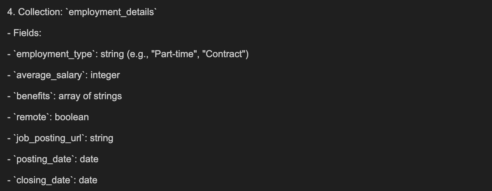

## CareerHub API

### Overview:

CareerHub API is a Flask-based RESTful API designed to manage job listings, companies, education, employment details, and industry information using MongoDB as the backend database. The API allows users to create, read, update, delete, and search job postings, as well as filter jobs based on criteria like salary range and experience level.

The features provided within the project are as follows:

- Create new job postings
- Search for job postings by job ID
- Update job details by job title
- Delete job postings by job ID
- Filter jobs based on salary range and experience level

### Prerequisites

Before running the app, ensure you have the following libraries installed:

- Required Python libraries (`pandas`,`os`, `json`, `pymongo`, `flask`, `bson`)

### Schema Chosen

The scheme chosen for this project is dependent on 5 different tables. The screenshots provided will allow us to see The Schemas chosen for this project can be found below.

The tables/collections are as follows:

1. Jobs

2. Companies

3. Education and Skills

4. Employment Details

5. Industry Info

### Running the App

- install and run the required docker yml file using "docker compose up"
- Please make sure to correct the volumes field for the directories in the docker compose file -> change it to reflect the local machine's directory where the file is stored
- Access the mongo db shell using the command "docker exec -it mongoprojecttwo mongosh" this can be used to see the successful imports of data and debugging
- Run the python script for importing the data from the csv files to the "python import_data.py"
- Now open a new terminal in the directory the files are stored and use the command "python run.py" this shall allow the app to run successfully as this calls from the app.py for the app to run
- Now you can view the updates in real time by either accessing the browser or postman.

Please keep in mind that the ports assigned here at 5001. If this port is busy for you either stop the process assgined to that port, or just change the ports within the app.py and run.py script. Also, make sure to change the link used to see whether the app is successfully being run.

### Screenshots

Successful importing of data

Schema:

### Accessing features and understanding the features

#### 1. Welcome Route

- Method Type: GET
- Description: This is the API's homepage. When accessed, it returns a simple welcome message to the user.
- How to Use:
  Access it by navigating to `http://localhost:5001` in your browser or by making a GET request in Postman with the aforementioned URL.

#### 2. Create a Job Post

- Method Type: POST
- Description: This endpoint allows the user to create a new job post. It expects a JSON body containing the job details, including the job title, industry, description, salary, and location. It appends the post to the jobs collection and updates the other collections if there are other fields mentioned within the post.
- How to Use:
  Access it by navigating to `http://localhost:5001/create/jobPost` in your browser or by making a POST request in Postman with the aforementioned URL.  
  Please make sure that the title and industry for the job posting are mentioned. Otherwise, it will throw a 400 type error stating that the two fields name and industry are required. Also, within the body section in postman add the job posting in json format before sending the request.

#### 3. Search Job by ID

- Method Type: GET
- Description: This endpoint allows you to search for a specific job by its ID.
- How to Use:  
  Access it by navigating to `http://localhost:5001/search_by_job_id/1` in your browser or by making a GET request in Postman with the aforementioned URL. To search by the required job ID, change `1` to the number you desire.  
  Please make sure that the job ID used is present within the collections. Otherwise, it will throw a 404 type error stating that no job with that ID exists.

#### 4. Update Job Details by Title

- Method Type: GET, POST
- Description: This endpoint allows you to retrieve or update job details using the job title.
  - GET: Retrieve the current job details.
  - POST: Update the job’s description, salary, and location.
- How to Use:  
  For the GET method, use the URL `http://localhost:5001/update_by_job_title?title=xyz%20abc`, where `xyz` and `abc` are placeholders. An example would be as follows: `http://localhost:5001/update_by_job_title?title=Data%20Scientist`.  
  For the POST method, you can use the following URL: `http://localhost:5000/update_by_job_title`.  
  Please make sure that the job title used within the URL exists; otherwise, it will throw a 404 type error for the GET method. With the POST method, it will also throw a 404 type error.

#### 5. Delete Job by ID

- Method Type: DELETE
- Description: This endpoint allows you to delete a job from the database using its name.
- How to Use:
  Access it by navigating to `http://localhost:5001/delete_by_job_title`. Within the body of the Postman make sure to include the keys about the job title and the confirmation like this
  {
  "title": "Data Scientist",
  "confirmation": "yes"
  }
  Please make sure that the job used is present within the collections; otherwise, it will throw a 404 type error stating that no job with that ID exists.

#### 6. Search Jobs by Salary Range

- Method Type: GET
- Description: This endpoint allows you to search for jobs within a specific salary range.
- How to Use:  
  Access it by navigating to `http://localhost:5001/query_jobs_by_salary?min_salary=x&max_salary=y`, where you can specify the minimum and maximum salary values as query parameters. An example would be `http://localhost:5001/query_jobs_by_salary?min_salary=50000&max_salary=100000`.  
  If no jobs exist within the salary range, it will throw a 404 type error. Additionally, if the parameters for the min and max salary are not floats, it will also throw an error saying the URL is not accessible.

#### 7. Get Jobs by Experience Level

- Method Type: GET
- Description: This endpoint allows you to filter jobs based on experience level. Experience levels include:
  - Entry Level: 0-2 years of experience
  - Mid Level: 3-6 years of experience
  - Senior Level: 7+ years of experience
- How to Use:  
  Access it by navigating to `http://localhost:5001/jobs?experience_level=Entry%20Level`, where the `experience_level` query parameter can be "Entry Level", "Mid Level", or "Senior Level".  
  If the seniority levels are not mentioned as above, it will throw a 404 type error.

### How I used generative AI

- Helped me debug and understand tyhe demo code given to us
- Helped me understand how different end points work with one another.
- I also needed a guide as to automate the procees of uploading the json files to the database through collections

### Improvements

Retrieve information about companies, industries, and employment details (via future extensions)
